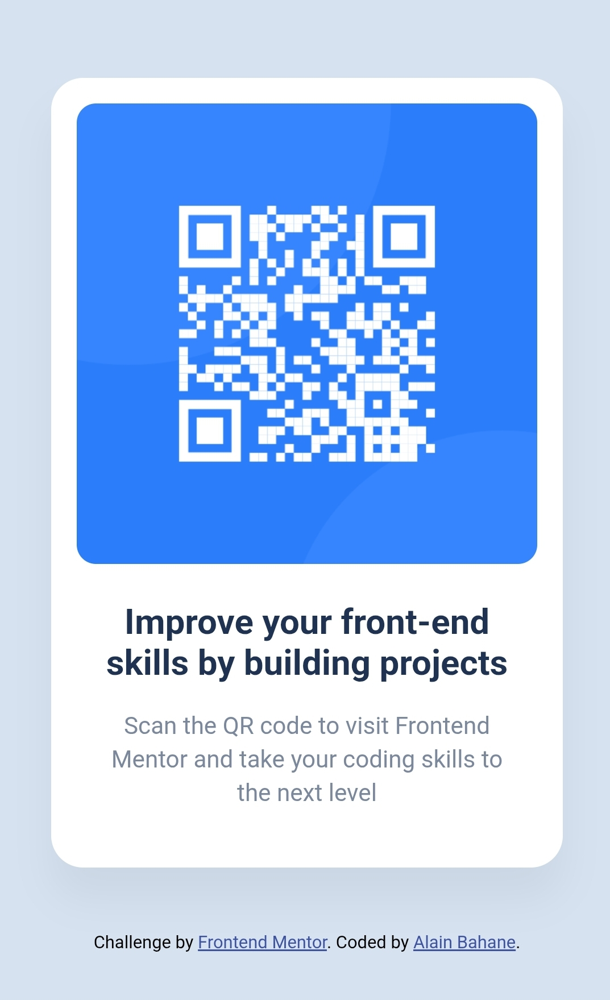

## What I learned

Through this project, I practiced building a simple responsive component using HTML and CSS. I learned how to center elements both vertically and horizontally using Flexbox, and how to structure my HTML and CSS with clear and descriptive class names.

I also improved my understanding of responsive design by applying a mobile-first approach and using media queries to ensure the layout works well on different screen sizes.

## Screenshot

## Challenges encountered

One of the main challenges was keeping the card perfectly centered on both mobile and desktop screens. Another challenge was positioning the attribution text below the card while keeping the overall layout balanced.

To solve this, I used Flexbox with `flex-direction: column` and adjusted the layout using media queries until the design matched the expected result.

## Improvements for future projects

If I revisit this project in the future, I would like to improve the semantic structure of the HTML by using elements such as `<figure>` and `<figcaption>`. I would also consider adding small animations or transitions to make the component more interactive.

Finally, I would refine the organization of my CSS to make the code even cleaner and easier to maintain for larger projects.

### AI Collaboration

During this project, I used ChatGPT as a learning assistant. It helped me clarify best practices for structuring HTML and CSS, organizing the project files, and drafting parts of this README. It was particularly helpful for understanding responsive layouts and how to correctly place the attribution section.

## Project Context

This project is my solution to the **Frontend Mentor "QR Code Component" challenge**.

The goal of the challenge is to recreate a QR code card component based on a provided design. It focuses on practicing core frontend skills such as writing clean HTML, styling with CSS, and building a responsive layout that works across different screen sizes.

## Author

- Frontend Mentor – [@AlainBahane](https://www.frontendmentor.io/profile/AlainBahane)
- Twitter – [@AlainBahane](https://www.twitter.com/AlainBahane)

## Live Project

You can view the deployed project here:  
https://freedev-group.github.io/QR-code-component-By-Alain/